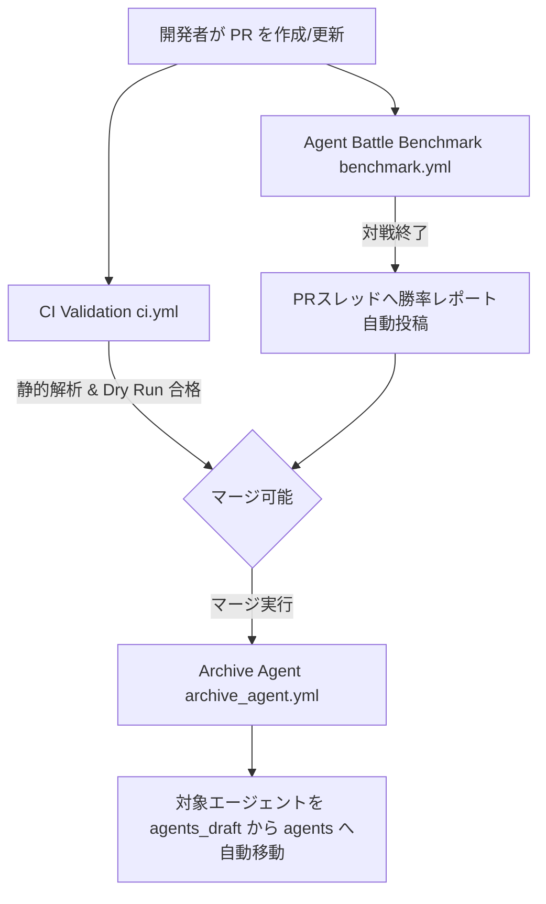

# PR・マージ時の自動Actionsマニュアル (docs/ci_cd_actions.md)

本ドキュメントでは、GitHub 上で Pull Request (PR) を作成してからマージされるまでの過程で自動実行される CI/CD ワークフロー（GitHub Actions）の役割と仕組み、およびそのために必要なリポジトリ初期設定について解説します。

---

## 1. 自動化ワークフローの全体像

Pull Request のライフサイクルに応じて、以下の3つのワークフローが実行されます。

---

## 2. 各ワークフローの仕様

### 2.1 CI Validation (`ci.yml`)
- **トリガー**: `main` ブランチに対する PR の作成・更新、および `main` へのプッシュ。
- **処理内容**:
  1. **Blackによるフォーマットチェック**: コードスタイルに違反がないか検証。
  2. **Flake8による構文エラーチェック**: 致命的な構文エラーや未定義の変数等がないか検証。
  3. **Mypyによる型チェック**: 静的型ヒントの整合性を検証。
  4. **Dry Run動作テスト**: 変更されたエージェントがシミュレータ上で1ゲーム正常に完走できるか自動検証 (`tests/dry_run.py`)。

### 2.2 Agent Battle Benchmark (`benchmark.yml`)
- **トリガー**: `main` ブランチに対する PR の作成・更新。
- **処理内容**:
  1. `git diff` を実行し、`agents_draft/` 配下で変更のあった開発中エージェント（例: `agents_draft/my_agent`）を自動検出します。
  2. **対戦相手 (Base) の決定**:
     - `main` ブランチの `latest_submission/main.py` （提出予定の最強候補エージェント）を対戦相手とします。
     - もし `latest_submission/` がまだ main ブランチに存在しない場合は、自動的に `sample_submission/main.py`（標準テンプレート）を対戦相手に指定するフォールバックが機能します。
  3. **自動対戦の実行**:
     - 検出した新旧エージェントを **20試合自動対戦** させ、勝率と平均ターン数を測定します。
  4. **PRコメントへの自動レポート投稿**:
     - 測定結果の勝率テーブルを、PRの会話スレッドに自動で書き込み（または上書き）します。
  5. **代表対戦の HTML Artifacts 保存**:
     - 対戦の様子を記録した HTML ビューアファイルを Actions の Artifacts にアップロードします。

### 2.3 Archive Agent (`archive_agent.yml`)
- **トリガー**: `main` ブランチへの PR マージ。
- **処理内容**:
  1. マージされたコミットを走査し、`agents_draft/` 配下で追加または修正されたエージェントフォルダを検出します。
  2. **自動移動 (Archiving)**:
     - 検出されたエージェントフォルダを `agents_draft/` から完成済みフォルダである `agents/` 配下へ自動的に移動（コピー＋削除）します。
     - これにより、未完成の開発中エージェントと、完成・マージ済みエージェントがフォルダ階層レベルで確実に分類・クリーンアップされます。
  3. **自動コミット**:
     - 移動した結果を GitHub Actions ボットが自動的にリポジトリへコミットし、`main` ブランチへ直接プッシュします。

---

## 3. GitHub 上で必要な初期設定

PRへの自動コメント投稿および Kaggle への自動提出ワークフローを正常に機能させるため、GitHub リポジトリの管理者権限で以下の設定を事前に行う必要があります。

### 3.1 Actions ワークフローへの書き込み権限の付与 (必須)
PRコメントの自動書き込みを行うために必要です。
1. リポジトリの **Settings -> Actions -> General** に移動します。
2. **Workflow permissions** セクションで **"Read and write permissions"** にチェックを入れて保存します。

### 3.2 Kaggle API トークンの登録 (自動提出を行う場合のみ)
マージ後に自動で Kaggle へ提出パッケージをアップロードするために必要です。
1. Kaggleのアカウント設定から `kaggle.json` をダウンロードします。
2. リポジトリの **Settings -> Secrets and variables -> Actions** に移動します。
3. **New repository secret** をクリックし、以下の2つを登録します：
   - `KAGGLE_USERNAME`: `kaggle.json` 内の `username` の値
   - `KAGGLE_KEY`: `kaggle.json` 内の `key` の値
