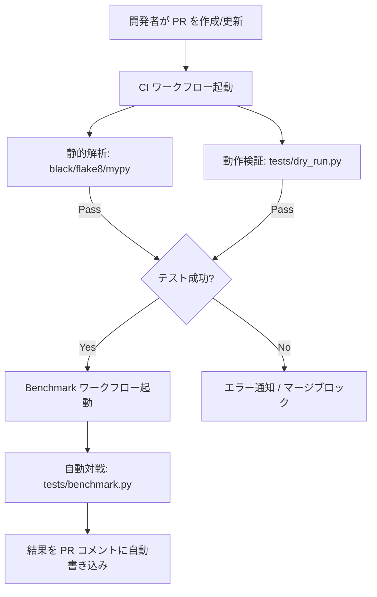

# CI/CD およびテストスクリプト 実装仕様書

本仕様書は、ポケモンカードゲーム AI エージェント開発において、チームでの GitHub 共同開発を安全かつ迅速に進めるための自動検証（CI/CD）システムとテストスクリプトの設計を定義したものです。

---

## 1. 全体設計

以下の図のように、Pull Request（PR）のライフサイクルに応じて、コード品質・正常動作・勝率ベンチマークを自動評価します。

---

## 2. 実装コンポーネント

### 2.1 動作検証スクリプト (`tests/dry_run.py`)
- **目的**: 提出パッケージ (`sample_submission/main.py`) のエージェントが、実行時エラーを起こさず、シミュレータ環境で1ゲーム完了できるかをテストします。
- **仕様**:
  - `kaggle-environments` の `cabt` 環境をロード。
  - 対象エージェントとランダムエージェントを対戦させ、最後まで正常終了することを確認する。

### 2.2 勝率測定ベンチマークスクリプト (`tests/benchmark.py`)
- **目的**: 新しいエージェントと既存のエージェント（またはベースライン）を指定回数対戦させ、勝率および平均ターン数を算出します。
- **仕様**:
  - コマンドライン引数でエージェントA、エージェントBのファイルパス、および対戦回数（デフォルトは50）を指定可能。
  - **自動パッチ適用機構**: インストールされている `kaggle-environments` の古い `cabt` エンジン（`libcg.so`等）を `sample_submission/cg/` 内の最新版で実行時に自動上書きコピーします（`__pycache__` の削除とインポートキャッシュのクリアも伴う）。
  - **モジュール二重ロード防止 (エイリアス設定)**: 親環境側とエージェント側で共有ライブラリ `libcg.so` が二重にロードされて状態が競合するのを防ぐため、`sys.modules['cg']` に環境側のモジュールを動的にリンクします。
  - **CWDとCSVロード制御**: `GameInitialize` 実行時に `PTCG_PROJECT_ROOT` 環境変数を利用して CWD をプロジェクトルートに強制制御し、カードデータ（CSVファイル）の読み込みエラーを防止します。
  - 勝率結果を標準出力で出力し、CIでパースしやすい設計にする。

### 2.3 对戦可視化スクリプト (`tests/visualize_match.py`)
- **目的**: 2つのエージェントを対戦させ、その全プレイ履歴をビジュアライズした HTML ビューアを作成します。
- **仕様**:
  - 引数でエージェントA、エージェントBのパス、および出力先HTMLのパス（デフォルトは `scratch/visualizer.html`）を指定可能。
  - `kaggle-environments` の `cabt` 環境を実行し、`env.render(mode="html")` でビジュアライズされた HTML を書き出します。
  - ブラウザで出力された HTML を開くことで、カードの動きやログ、対戦経過をアニメーション付きのGUIで再現・確認できます。

### 2.4 GitHub Actions 設定ファイル (`.github/workflows/`)

1. **`ci.yml`**:
   - トリガー: すべてのブランチへの PR、および `main` ブランチへのプッシュ。
   - 処理: Linter (flake8), Formatter (black), 型チェック (mypy) を実行し、その後 `dry_run.py` を実行。
2. **`benchmark.yml`**:
   - トリガー: `main` ブランチに対する PR の作成および更新。
   - 処理: PR ブランチのコードと `main` ブランチのコードをそれぞれロードし、`benchmark.py` で 50 回対戦させて勝率を算出。結果を PR へのコメントとして書き込む。
3. **`submit.yml`**:
   - トリガー: `main` ブランチへのマージ（プッシュ）。
   - 処理: `main.py` と `deck.csv` を `submission.tar.gz` に圧縮し、Artifact として保存。さらにオプションで Kaggle に自動提出。

---

## 3. GitHub 上で必要な操作 (ユーザー作業項目)

自動ベンチマークコメントと Kaggle への自動提出を有効化するために、GitHub リポジトリで以下の設定を行う必要があります。

1. **Actions の書き込み権限の付与 (PRコメント書き込み用)**:
   - リポジトリの **Settings -> Actions -> General** に移動。
   - **Workflow permissions** セクションで **"Read and write permissions"** を選択して保存。
2. **Kaggle API トークンの登録 (自動提出用)**:
   - Kaggleのアカウント設定から `kaggle.json` をダウンロード。
   - リポジトリの **Settings -> Secrets and variables -> Actions** に移動。
   - **New repository secret** をクリックし、以下の2つを登録。
     - `KAGGLE_USERNAME`: `kaggle.json` 内の `username` の値
     - `KAGGLE_KEY`: `kaggle.json` 内の `key` の値

---

## 4. 実行環境の選定方針

### 4.1 Kaggle公式環境とローカル/CIの差異
Kaggleのシミュレーションコンペでは、Pythonのバージョンや、`numpy` などのライブラリのバージョンが固定されています。また、本ゲームエンジン `libcg.so` は Linux (Ubuntu) x86_64 バイナリです。
- **CI (GitHub Actions) 上の環境**: `ubuntu-latest` を使用するため、共有ライブラリ `libcg.so` はそのままロード・動作します。
- **ローカル開発環境**:
  - ユーザーの OS は Linux ですので、ローカルに直接 `kaggle-environments` などをインストールして動作させることが可能です。
  - 他のチームメンバー（macOSやWindows環境など）がいる場合は、Kaggle提供の Python Dockerイメージ（`gcr.io/kaggle-images/python`）などをベースにした Docker コンテナ上で動作・検証するのが最も確実です。
