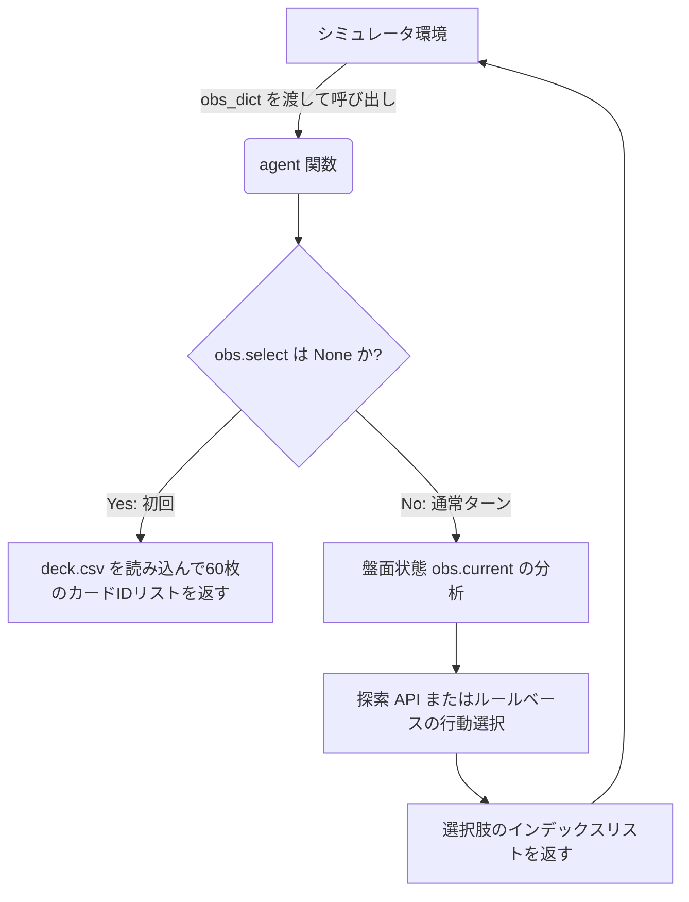

# プロジェクト仕様書: ポケモンカードゲーム AI エージェント開発

本プロジェクトは、ポケモンカードゲーム（Pokémon Trading Card Game, TCG）の対戦 AI エージェントを開発および評価するためのシミュレーション環境とデータセットから構成されています。

---

## 1. プロジェクト概要

提供されたゲームシミュレータ（C++ 動的ライブラリ）およびカードのマスターデータを用いて、意思決定を行う AI エージェント（Kaggle 提出用等）を構築します。

- **目的**: 提示される盤面状態（`Observation`）から最適なプレイ（カードの使用、攻撃、ベンチ展開、エネルギー装着など）を選択し、対戦で勝利するエージェントの実装。
- **特徴**: ゲーム状態をシミュレータ上で複製し、エージェント側で先読み（探索）を行うための API（`search_begin`, `search_step` 等）が提供されています。

---

## 2. 技術スタック

- **コア言語**: Python (エージェント開発、シミュレータの呼び出し)
- **シミュレータエンジン**: C++ 等で記述されたバイナリライブラリ (`libcg.so` / `cg.dll`)
  - Python の `ctypes` モジュールを介して呼び出されます。
- **データ形式**: CSV (カードマスターデータ), JSON (シミュレータとのデータ授受)

---

## 3. ディレクトリ構成と主要ファイル

```
/home/dice/programs/pole/
├── Card_ID List_EN.pdf       # 英語版カードID対応リスト（画像等）
├── Card_ID List_JP.pdf       # 日本語版カードID対応リスト（画像等）
├── EN_Card_Data.csv          # 英語版カードマスターデータ
├── JP_Card_Data.csv          # 日本語版カードマスターデータ
└── sample_submission/        # 提出パッケージ / 開発用コード
    ├── deck.csv              # エージェントが使用するデッキ（60枚のカードID）
    ├── main.py               # エージェントのメインエントリーポイント
    └── cg/                   # シミュレータラッパーライブラリ
        ├── __init__.py
        ├── api.py            # データ定義（Dataclass/Enum）および探索用 API
        ├── game.py           # バトルの開始や選択の反映など、ゲーム制御用 API
        ├── sim.py            # ctypes を用いた libcg.so / cg.dll のロードとバインディング
        ├── utils.py          # JSON と Dataclass の相互変換ユーティリティ
        ├── libcg.so          # Linux 用シミュレータバイナリ
        └── cg.dll            # Windows 用シミュレータバイナリ
```

---

## 4. 主要モジュールの役割

### 4.1 カードデータ (`EN_Card_Data.csv` / `JP_Card_Data.csv`)
各カード ID に紐づくカード情報（カード名、HP、タイプ、進化段階、技、効果説明など）が格納されたデータベースです。エージェントがカードの効果を解釈し、ルールに基づいたプレイを行うための参照先となります。

### 4.2 エージェントメイン処理 (`sample_submission/main.py`)
シミュレータ環境から呼び出される `agent(obs_dict: dict) -> list[int]` 関数を定義します。
- **初期ターン（`obs.select` が `None` の場合）**: デッキ（`deck.csv`）に対応する60個 of カードIDリストを返します。
- **通常ターン**: `obs.select.option` に格納された有効な選択肢リストから、選択するインデックスのリストを返します。

### 4.3 シミュレータ API (`sample_submission/cg/api.py`)
ゲーム状態を表すデータモデルと、探索（サーチ）のための API が定義されています。

- **主要なデータクラス**:
  - `Card`: 各カードの ID、シリアル番号、所有プレイヤー情報を保持。
  - `Pokemon`: フィールド上のポケモンの状態（HP、付いているエネルギー、ツール、進化前カード等）を保持。
  - `PlayerState`: プレイヤー個別の状態（バトル場、ベンチ、山札の枚数、トラッシュ、サイド、手札等）を保持。
  - `State`: ゲーム全体の進行状態（ターン数、先行/後攻、スタジアム、現在のターンプレイヤー等）を保持。
  - `Observation`: 選択肢情報（`SelectData`）、ゲームログ（`Log`）、および現在の状態（`State`）を保持。
- **探索 API**:
  現在の観測（`Observation`）から状態を複製し、エージェント内でシミュレーション（探索）を実行するための以下の関数を提供します。
  - [search_begin](../sample_submission/cg/api.py#L517): 自身のデッキ/サイド、相手のデッキ/サイド/手札などの予測（非公開情報）を入力し、探索を初期化します。
  - [search_step](../sample_submission/cg/api.py#L597): 選択肢インデックスを送信し、シミュレーション上の次の状態を取得します。
  - [search_end](../sample_submission/cg/api.py#L629) / [search_release](../sample_submission/cg/api.py#L633): 探索状態のメモリ解放。

---

## 5. エージェントの動作フロー



---

## 6. 今後の開発に向けた確認事項

1. **エージェントのアルゴリズム方針**:
   - ルールベースのヒューリスティックエージェントを作成するか、あるいはモンテカルロ木探索（MCTS）などの探索ベースのエージェントを作成するか。
2. **デッキのカスタマイズ**:
   - `deck.csv` を編集して異なるシナリオやデッキ構成でのシミュレーション・評価を行うか。
3. **探索の非公開情報の扱い**:
   - `search_begin` では「相手の手札」や「サイド」、「お互いの山札の残り」といった非公開情報を予測（あるいは推測値）として入力する必要があります。この情報予測モデル（トラッカー）をどのように設計するか。
