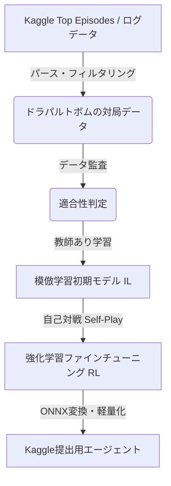

# ドラパルトex ＋ カースドボム専用 強化学習エージェント設計仕様書 (Draft)

本仕様書は、Kaggle「ポケモンカードゲーム AI バトルチャレンジ」における「ドラパルトex ＋ ヨノワール（カースドボム）」デッキに特化した、模倣学習（IL）および強化学習（RL）エージェントの設計仕様を定義するものです。

---

## 1. 背景と設計思想

### 1.1 設計思想：汎用状態表現フレームワーク ＋ デッキ特化型報酬プラグイン
本エージェント設計は、**「状態表現およびネットワークのエンコーダー（バックボーン）は汎用的なポケモンカードのルールを汎化して捉える共通フレームワークとし、個別のデッキに特異な勝ち筋（自爆布石など）は報酬関数およびカリキュラム学習のプラグインとして外部から差し替える」**というモジュール設計思想を厳格に採用します。
これにより、将来的に他のデッキ（例：ハラバリーexアグロやLOデッキ等）に開発対象をシフトした際にも、状態の次元構成や Encoder 構造を一切変更することなく、報酬設計（Chapter 5）を差し替えるだけで速やかに強化学習を再適用できる高度な再利用性を担保します。

### 1.2 解決すべき技術的課題
1. **遅延報酬の帰属問題 (Credit Assignment Problem)**:
   ヨノワール等の特性「カースドボム」で自爆し、サイドを献上しつつ相手にダメカンを乗せる行動（布石）の時点では、即時サイド報酬はゼロ（またはマイナス）になります。数ターン後に一気にサイドを取るまで報酬が得られないため、布石行動の価値が正しく伝播しにくいです。
2. **状態表現におけるベンチダメカン分布の重要性**:
   ドラパルトexのワザ「ファントムダイブ」のダメカン6個の割り振りや、カースドボムの狙い先を決めるためには、相手ベンチのダメカン分布と進化・HP状況を極めて高解像度で入力する必要があります。
3. **動的アクション空間と推論速度（600秒ルール）の競合**:
   ターンごとに選択肢の数が動的に変わる仕様において、1肢ずつNNを推論する Q(S, A) 方式ではタイムアウトのリスクが生じます。1回のフォワードパスで一括評価できる **ポインターネットワーク (Pointer Network)** の採用が必須です。

---

## 2. システム構成

エージェントの構築は、限られた計算資源（CPU: 8コア/16スレッド, GPU: RTX 5060 Ti, RAM: 30.5GB、コンテナ全体の最大RAM制限: 15GB）で最大のパフォーマンスを出すため、以下の段階で進めます。



1. **データの事前監査（ILデータ監査）と第5.4節への依存関係**:
   学習を開始する前に、Kaggle の daily top episodes データベース（SQLite 形式等）をパースし、「ドラパルトex（ID 121）＋ サマヨール・ヨノワール（ID 132/133）」を使用している対局が十分に存在するか（目安：数千〜数万試合）を確認・監査します。この監査結果によって、第5.4節（破滅的忘却対策）の適用方針が動的に分岐します。
   * ⚠️ **フォールバックの設計（直接RLの極めて高い難易度）**:
     もし十分なデータ量がない場合、単に「RLを直接起動する」というフォールバックは局所解へのスタック（「ヨノワールを出さない・自爆しない」という局所的なマイナス回避行動）を引き起こし、布石戦略が永久に発見されないリスクが高いです。
     したがって、データ不足時は、**計画B-1 (カリキュラム学習のみ / 5.4節の正則化はスキップ)**、または **計画B-2 (自前で弱いルールベースを動かして簡易ILデータを自己生成し、5.4節の正則化係数を 1/10 程度に弱めて適用する)** のいずれかの方針を選択します。あるいは **計画B-3 (ハラバリーex等の順方向デッキへの変更)** を行います。
2. **模倣学習フェーズ (Imitation Learning)**:
   * 監査により十分なデータ量が確認された場合、ドラパルトボムの棋譜を抽出し、教師あり学習を行います。
   * **ポインター構造との整合性と損失関数**:
     ポインターネットワークは各 Option に対する Softmax 確率分布を出力する構造であるため、IL時の教師あり学習も固定クラスの多クラス分類ではなく、**「可変長 Cross Entropy 損失 (Negative Log Likelihood)」**を適用して学習します。人間の正解アクションのインデックスを y_star とし、出力確率を p_i とした時、損失は $Loss_{\text{IL}} = -\log p_{y\_star}$ となります。
     Actor ネットワーク構造は IL フェーズと RL フェーズで完全に共通のものを使用するため、モデル変更を挟まずシームレスに強化学習へパラメータを移行できます。
3. **強化学習フェーズ (Reinforcement Learning)**:
   構築した初期ポリシーをベースに自己対戦（Self-Play）を行い、PPO アルゴリズムを用いて、サイドレースのコントロールやダメカン割り振りの最適化をファインチューニングします。
4. **ONNX変換と推論最適化**:
   学習した PyTorch モデルを ONNX 形式に変換し、Kaggle 提出環境で 600秒以内 に安定して動作するよう推論を高速化します。

---

## 3. 状態表現 (State Representation)

状態ベクトル S は、単純な1枚の平坦ベクトルではなく、エンコーダーの構造（DeepSets）に合わせた**「構造化テンソル（ディクショナリ形式）」**としてネットワークへ供給し、インターフェースの整合性を担保します。

### 3.1 フィールドスロット特徴量の共通エンコーディング（d = 64次元）
バトル場（最大1枠）およびベンチ（最大5枠）の各枠に対し、以下の d = 64 次元のベクトルを個別に抽出し、スロットシーケンスとして処理します。
* `Card_ID` (32次元の共有 Embedder にマッピング)
  * ⚠️ **共有 Embedder の定義**:
     盤面のカードID、手札のカードID、トラッシュのカードID、および選択肢（Option）内の `Target Card Embedding` は、**Actor-Criticモデル全体で単一の「共有埋め込み行列（Card Embedding Matrix, 2100×32次元）」を参照します**。カードIDが持つ「進化系統」や「進化段階」といった意味的特徴は共通であるため、埋め込み表現を共有させることでパラメータ数を劇的に削減しつつ、情報抽出能力を最大化します。
* `Remaining_HP` (最大HPに対する割合, 1次元: 0.0〜1.0)
* `Damage_Counters` (乗っているダメカンの割合, 1次元)
  * ⚠️ **ダメージ量の正規化**:
     本環境における最高HP（exポケモンの最大HP 320 = ダメカン32個）を基準とし、`Damage_Counters / 32` で 0.0〜1.0 に正規化した値を使用します。
* `Energy_Amount` (付いているエネルギーの各タイプごとの正規化カウントベクトル, 16次元)
  * `Energy_Amount / 10` で 0.0〜1.0 に正規化した値（各16タイプごと）を使用します（10枚を超える場合は 1.0 でクリップ）。
* `Is_Active` (バトル場か否かのフラグ, 1次元: 0 or 1)
* `Special_Condition_Flag` (特殊状態の有無フラグ, 1次元: 0 or 1)
  * バトル場ポケモンのみで有効なフラグ（ベンチでは常に0：ベンチ退避で解除されるためルール的に正しい挙動）。
* `Retreat_Cost` (にげるために必要なエネルギー数, 1次元: 0.0〜1.0)
  * `Retreat_Cost / 4` で 0.0〜1.0 に正規化した値を使用します（最大コスト4）。
* `Rule_Box_Flag` (exポケモンなどのルール持ちか否かのフラグを示す 1-hot ベクトル, 11次元)
  * **内訳（計11種類）**:
    1. なし (一般ポケモン)
    2. ex
    3. V
    4. VMAX
    5. VSTAR
    6. かがやく
    7. GX
    8. EX (旧裏/旧シリーズ)
    9. 伝説 (LEGEND)
    10. テラスタル (特殊効果・ベンチダメージ無効等)
    11. その他特別ルール持ち（プリズムスター、BREAK等を含む）
* ※ 各スロットの次元数は `32 + 1 + 1 + 16 + 1 + 1 + 1 + 11 = 64次元` に完全にアラインされます。

### 3.2 構造化入力テンソルのインターフェース構成
状態ベクトル S は、以下の独立した5つのテンソルから構成される辞書型として定義され、第4.3節のエンコーダーへ入力されます。

1. `opponent_active` (形状: `[Batch, 1, 64]`): 相手のバトル場（1枠）
2. `opponent_bench` (形状: `[Batch, 5, 64]`): 相手のベンチ（5枠）
3. `own_active` (形状: `[Batch, 1, 64]`): 自分のバトル場（1枠）
4. `own_bench` (形状: `[Batch, 5, 64]`): 自分のベンチ（5枠）
5. `global_features` (形状: `[Batch, 210]`): 盤面以外のグローバル情報（210次元）
   * **内訳**:
     * `own_hand_mean` (32次元): 手札各カードIDの Embedding 平均ベクトル
     * `own_hand_sum` (32次元): 手札各カードIDの Embedding 合計ベクトル
       * ⚠️ **手札のプーリング改善**: 平均（Mean）だけでは「ネストボール4枚」と「1枚」の区別がつかず枚数情報が消失するため、Mean と Sum-Pooling を Concat した計 **64次元** として表現します。
     * `own_discard_mean` (32次元): 自トラッシュ各カードIDの Embedding 平均ベクトル
     * `own_discard_sum` (32次元): 自トラッシュ各カードIDの Embedding 合計ベクトル
     * `opponent_discard_mean` (32次元): 相手トラッシュ各カードIDの Embedding 平均ベクトル
     * `opponent_discard_sum` (32次元): 相手トラッシュ各カードIDの Embedding 合計ベクトル
     * `own_prize_1hot` (6次元): 自分の残りサイド数（1〜6枚）の 1-hot
     * `opponent_prize_1hot` (6次元): 相手の残りサイド数（1〜6枚）の 1-hot
     * `own_deck_count` (1次元): `deckCount / 60` で 0.0〜1.0 に正規化した値
     * `opponent_deck_count` (1次元): `deckCount / 60` で 0.0〜1.0 に正規化した値
     * `opponent_hand_count` (1次元): `handCount / 20` で 0.0〜1.0 に正規化した値（20枚超は1.0でクリップ）
     * `Is_First_Player` (1次元): 自分が先攻か後攻かを示すフラグ (0 or 1)
     * `support_played` (1次元): この番にすでにサポートを使用したか (0 or 1)
     * `Current_Turn` (1次元): `turn / 100` で正規化したゲーム全体の絶対経過ターン数 (最大 1.0)

### 3.3 構造化テンソルの総次元数の計算とメモリ効率
上記のエンコーディング設計による、状態情報に含まれる総次元数の内訳は以下の通りです。

| 特徴量の分類 | 次元数計算 | サブ合計次元 |
| :--- | :--- | :--- |
| **相手の場 (バトル1 + ベンチ5)** | (1 + 5)枠 × 64次元 | 384次元 |
| **自分の場 (バトル1 + ベンチ5)** | (1 + 5)枠 × 64次元 | 384次元 |
| **グローバル特徴量** | 手札(64) + 自トラ(64) + 敵トラ(64) + サイド自敵(12) + 山札自敵(2) + スカラ情報(4) | 210次元 |
| **合計状態次元数 ($D_{\text{state}}$)** | | **978次元** |

次元数は **978次元** になり、15GB RAM 制限下でも極めて高速に推論可能です。

---

## 4. 行動表現とポインターネットワーク (Pointer Network)

動的に変化する選択肢 `obs.select.option` に対し、1回の推論で最も期待値の高い選択肢を出力するアーキテクチャを設計します。また、可変長入力に対応するため、ONNX 変換時の動的形状対策を組み込みます。

```
[状態テンソル辞書 S]
      |
      +---> `opponent_bench` (5, 64) ---------+
      |                                        v
      |                              [ベンチ個別 MLP] (128)
      |                                        |
      |                                        v
      |                            [マスク付き Max/Mean/Sum Pool] (384) --+
      |                                                                    |
      +---> `opponent_active` (1, 64) -------> [MLP] (128) -----------------+
      |                                                                    |
      +---> `own_bench` (5, 64) --------------+                            |
      |                                        v                           |
      |                              [ベンチ個別 MLP] (128)                 |
      |                                        |                           |
      |                                        v                           |
      |                            [マスク付き Max/Mean/Sum Pool] (384) --+--> [Concat & 共有 MLP] ---> 共有状態ベクトル s (k次元)
      |                                                                    |                                 |
      +---> `own_active` (1, 64) ------------> [MLP] (128) -----------------+                                 +-------+
      |                                                                    |                                 |       |
      +---> `global_features` (210) ---------> [MLP] (128) -----------------+                                 v       v
                                                                                                         [Dot Product] [Critic MLP]
                                                                                                                 |       |
                                                                                                                 v       v
                                                                                                              Actor   Critic
```

### 4.1 オプション特徴量の具体的エンコーディング構成
各選択肢 A_i（可変長、最大 N_max = 512）について、以下の固定長特徴ベクトル a_i を生成してNNに入力します。

1. **アクションタイプ埋め込み (Action Type Embedding)** (16次元):
   * アクションの種類に対応する ID を Embedding 化します（PLAY, ATTACH, EVOLVE, ABILITY, DISCARD, RETREAT, ATTACK, END, CARD, YES_NO, NUMBER, SPECIAL_CONDITION の計12種に分類）。
2. **対象カード埋め込み (Target Card Embedding)** (32次元):
   * アクションの対象となるカード ID（1〜2100）の共有埋め込みベクトル。対象がない場合はパディング（ID 0）。
3. **対象位置エンコーディング (Target Position One-Hot)** (16次元):
   * アクションが適用される場の位置を表現する 16次元の 1-hot ベクトル。
4. **追加メタデータ** (8次元):
   * ワザのダメージ期待値（最大ダメージに対する割合）、必要なエネルギー数などの数値特徴。
   * ⚠️ **`NUMBER` アクションタイプの数値マッピングとガード**:
     `NUMBER` アクションでは対象カードがないため埋め込みは ID 0 とします。選択値そのもの（例: ダメカンの個数）は、このメタデータの第1次元に、正規化値（`number / N_max_choice`）として格納します。
     正規化分母の `N_max_choice` は、`obs.select.option` の中のすべての数値選択肢（`number`）から動的に抽出しますが、NUMBER型のアクションが1つも存在しない場合の `ValueError`（空配列の `max()` 呼び出し）を防ぐため、デフォルトフォールバックを 1 とし、`N_max_choice = max([opt.number for opt in obs.select.option if opt.number is not None] + [1])` として安全に算出します。
   * ⚠️ **多標的ワザ (ファントムダイブ等) のダメージ配置パラメータマッピング**:
     ファントムダイブ等でベンチポケモンを選択する際、Option ごとに「誰に（`inPlayIndex`）何個（`count`）」という情報が格納されています。この `count / 6` (最大ダメカン6個に対する比率) および `inPlayIndex / 5` をメタデータの第2、第3次元に格納することで、アテンションが配置先を区別できるようにします。

これらを結合したベクトル（計 72次元）を MLP に通し、共有状態ベクトル s と同じ次元数 k のアクションベクトル a_i にマッピングします。

### 4.2 ONNX 変換における動的形状とパディング対策
ポインターネットワークは、選択肢数 N が毎ターン変化するため、ONNX モデルエクスポート時にバッチサイズおよびアクション選択肢数次元を動的軸（`dynamic_axes`）としてエクスポートします。
* ⚠️ **最大選択肢数 N_max = 512 のガードレール**:
  バッファオーバーフローを防止するため、ONNX 変換時および推論時には必ず `assert len(obs.select.option) <= 512` による事前アサーションを実施します。万が一、将来のカード追加で 512 を超えた場合は切り捨て処理、または例外ハンドラーをトリガーさせます。

### 4.3 PPO Value ネットワーク (Critic) の設計
* **状態エンコーダーの共有 (Shared Encoder)**:
  構造化テンソル S を受けて共有状態ベクトル s を出力する Encoder バックボーンは、Actor と Critic で完全に共有し、パラメータ共有次元数は **k = 128** と定義します。
* **バックボーンエンコーダーの構造決定 (DeepSets方式による順不同性の担保)**:
  RAM 15GB の制限を考慮し、Transformer構造は採用しません。また、順序依存する GRU に代わり、ベンチ枠の順不同性 (Permutation Invariance) を保証する **「DeepSets 方式」** に決定します。
  1. 自分のベンチ (`own_bench`) および相手のベンチ (`opponent_bench`) の各スロット（最大5枠、それぞれ64次元）を、共有の MLP (64 -> 128次元) で個別に並列処理します。
  2. 処理した5スロットのベクトルを **「マスク付き Max/Mean/Sum-Pooling」** で集約し、それぞれ 384次元（$128 \times 3$ 次元）のベンチ代表ベクトルを得ます。
     * ⚠️ **マスク付きプーリング**: 有効なポケモンのみを集約するため、空きスロットの特徴ベクトルに対して事前に十分に小さな値（Max用: `-1e9`、Sum/Mean用: `0.0`）を代入（マスクアウト）した状態でプーリングを実行します。
     * ⚠️ **集約の結合 (Max/Mean/Sum の Concat)**: Max-Pooling（最もHPが低い標的の強調）に加え、Mean-Pooling（全体の平均的なHP状況）、Sum-Pooling（敵全体の総HPリソース量）の3つを結合し、情報損失を完全に回避した 384 次元表現とします。
  3. 集約した自敵ベンチベクトル、自敵バトル場ベクトル（MLPで128次元に投影）、および `global_features`（MLPで128次元に投影）の計5本のベクトルを結合（Concat）します。
     * ⚠️ **統合MLPの入力次元計算**:
       * 自分のベンチ集約: 384次元
       * 相手のベンチ集約: 384次元
       * 自分のバトル場（MLP後）: 128次元
       * 相手のバトル場（MLP後）: 128次元
       * グローバル特徴量（MLP後）: 128次元
       * したがって、結合ベクトルの合計次元数は `384 + 384 + 128 + 128 + 128 = 1152次元` となります。
     * この結合ベクトルを、統合 MLP（入力 **1152次元** -> 出力 k = 128次元）を通して、最終的な共有状態ベクトル s を抽出します。
* **LayerNormの採用**:
  ベンチの `Special_Condition_Flag = 0` による分散ゼロの影響を完全に回避し、強化学習の相関の強いバッチ学習を安定させるため、層間正規化には Batch Normalization ではなく **Layer Normalization (LayerNorm)** を全面的に適用します。
* **Critic ヘッドの構造と損失関数**:
  共有された k = 128 次元の状態ベクトル s に対し、Actor とは完全に独立した全結合ヘッド（MLP: 入力 k 次元 -> 隠れ層 128 次元 [ReLU] -> 出力 1次元）を結合し、現在の状態の予測価値 V(S) をスカラとして出力します。
  学習の安定化（外れ値勾配への頑健性）のため、Critic 損失関数には MSE Loss ではなく **Huber Loss** に一本化します。

---

## 5. 報酬設計 (Reward Design)

遅延報酬の帰属問題を解決し、かつ「ダメカン蓄積報酬による引き延ばし局所解」を回避するため、Ng et al. (1999) の理論に基づき、**Potential-Based Reward Shaping (PBRS)** を採用します。

$$R_t = R_{\text{match}} + R_{\text{side\_diff\_adjusted}} + (\text{gamma} \times \Phi(s') - \Phi(s))$$

### 5.1 各報酬項の定義とボム自爆のペナルティ補正

1. **最終勝敗報酬 ($R_{\text{match}}$)**:
   * 勝利: +1.0 / 敗北: -1.0
2. **カースドボム自爆を考慮したサイド差変化報酬 ($R_{\text{side\_diff\_adjusted}}$)**:
   * $$R_{\text{side\_diff\_adjusted}} = \Delta \text{Side}_{\text{opponent\_taken}} - \text{gamma\_bomb} \times \Delta \text{Side}_{\text{own\_taken}}$$
   * ※ 自爆特性リストに含まれるカードIDによるきぜつ時は、gamma_bomb を 1.0 から 0.2 に減衰させ、自爆ペナルティを軽減します。
3. **ボム戦略用ポテンシャル報酬 (PBRS / $\text{gamma} \times \Phi(s') - \Phi(s)$) と理論的整合性**:
   * PBRS において、最適ポリシーの保存（不偏性）が数学的に証明されるための絶対条件は、**「ポテンシャル関数 $\Phi(s)$ が状態 $s$ のみの関数（行動に依存しない）であること」**です。
   * したがって、以前の設計案にあった「カースドボムが使われたターンのみ有効化する（行動依存のゲーティング）」は不偏性を破るため完全に撤廃します。ポテンシャル $\Phi(s)$ は、カースドボムのみならず通常ワザ（ファントムダイブ等）によるダメカン付与も含め、**純粋に相手盤面の状態 $s$（ダメカン分布そのもの）のみの関数**として定義します。
     $$\Phi(s) = \text{beta} \times \sum_{i \in \text{Opponent\_Field}} w_i \times \text{DamageCounters}_{i, s}$$
     * ※ beta = 0.05 程度に設定。
     * ※ w_i = 1.0 + KO_Bonus_i（きぜつ時: +1.5、瀕死状態(HP <= 30)時: +0.5、その他: +0.0）
     * 通常攻撃でのダメカン付与時にも正のポテンシャル報酬が支払われますが、これはゲーム初期段階での「攻撃行動」への学習をブートストラップする上で非常に効果的であり、かつ引き延ばしによるダメカンの無限稼ぎは、タイムステップ割引（gamma = 0.997）によるペナルティによって相殺されるため、Ng et al. (1999) の理論通り最適ポリシーの保存が完全に成立します。
4. **タイムステップ割引による「最短勝利」の強制**:
   * 収益（Return）の計算に割引率 **gamma = 0.997** を導入し、手数がかかるほど総報酬が目減りするように設計します（80ステップ後でも減衰率約 0.78 を維持し、序盤の自爆布石の価値伝播とLO回避を両立）。

### 5.2 カースドボム自爆の検出方法と拡張設計
環境から返される `obs.logs` (型 `list[Log]`) の構造データを走査し、同一ターンに発生した以下のイベントペアを照合します。
* `Log.type == LogType.MOVE_CARD` において、自爆クリーチャーIDリスト（マスタ辞書 `BOMB_CREATURE_IDS = {132, 133}`）に属するポケモンが自分のベンチ/アクティブから `AreaType.DISCARD` に移動。
* `Log.type == LogType.HP_CHANGE` かつ `Log.putDamageCounter == True` で相手に負の value が発生。
* ⚠️ **マスターデータ設計の分離**: カード追加によるサイレント崩壊を防ぐため、自爆対象カードIDはハードコードせず外部のマスタ構成 `BOMB_CREATURE_IDS` で一元管理し、ログ検出時の条件判定にマッピングします。

#### 5.2.1 報酬パースの単体テスト (Unit Test) ガードレール
C++シミュレータの `Log` 構造変更が原因で報酬設計がサイレントに壊れるのを防ぐため、CI/CD パイプライン上で**報酬モジュールの単体テストを義務付けます**。
* テストケース: ダミーの `Observation` ログリスト（ヨノワールがDISCARDに移動し、相手にダメージが入る `Log` イベント）を入力した際、報酬関数が正しく `gamma_bomb = 0.2` を反映し、自爆時のポテンシャル差分報酬が正しく算出されることをテストコードで検証します。

### 5.3 カリキュラム学習 (アニーリングスケジュール) の具体定義
* **対戦相手プールとウェイト**:
  1. `StarEx` : 重み 40% (フェーズ1中は DragonBomb の重みを吸収し **70%**)
  2. `DragonBomb` (ドラパルトボムミラー) : 重み 30% (**フェーズ1中は 0%**)
  3. `IonoBellibolt` (高速高打点アグロ) : 重み 20%
  4. `RandomAgent` (ルール順守用) : 重み 10%
* **移行基準の擬似コード (Pseudo-code)**:
  ```python
  # 評価 Worker 上で 2,000 エピソードごとに非同期実行 (CPU制限: 2コア)
  # weighted_winrate = sum(winrate[i] * weight[i])
  
  if current_phase == 1:
      if episode >= 100000 or (episode >= 20000 and weighted_winrate_excluding_mirror > 0.35):
          transition_to_phase_2()
          
  elif current_phase == 2:
      if episode >= 300000 or (episode >= 100000 and weighted_winrate_including_mirror > 0.55):
          transition_to_phase_3()
  ```
  * ⚠️ **アニーリング同期**: フェーズ2の期間中、$\beta$、$\lambda_{\text{KL}}$、$\lambda_{\text{BC}}$ をそれぞれ同期して線形に 0.0 までアニーリング減衰させ、フェーズ3では正則化および補助報酬を完全にゼロにします。

### 5.4 模倣学習から強化学習への移行における「破滅的忘却」対策
* ⚠️ **事前データ監査（第2.1節）結果による条件分岐**:
  * **計画B-1（ILデータなし）**: **本 5.4 節の正則化対策はすべてスキップ（無効化）**します。
  * **計画B-2（自前簡易IL）**: $\lambda_{\text{BC}}$ および $\lambda_{\text{KL}}$ の強さを通常の 1/10 程度に弱め、RLによる自律探索を妨げないように調整します。
  * **計画B-3（デッキ変更）**: 正則化をフル適用します。
* **損失関数 (Loss Function) の統合と逆KL（Mode-seeking）の採用**:
  $$Loss_{\text{total}}(\text{theta}) = Loss_{\text{PPO\_CLIP}}(\text{theta}) + \text{lambda\_KL} \times D_{\text{KL}}(\pi_{\text{theta}} \parallel \pi_{\text{IL}}) + \text{lambda\_BC} \times L_{\text{BC}}(\text{theta})$$
  * ※ 逆 KL ($D_{\text{KL}}(\pi_{\text{theta}} \parallel \pi_{\text{IL}})$) を最小化することで、現在のポリシー pi_theta を IL ポリシー pi_IL で高確率だった行動（自爆など）のシャープな選択（Mode）に強く引き寄せます。

### 5.5 自己対戦 (Self-Play) の対戦相手管理ポリシー
* **チェックポイントの保存とストレージ枝刈りポリシー**:
  * 5,000 エピソードごとにチェックポイントモデル（約100MB）を保存。ディスク容量削減のため、プール内に保持するチェックポイント数は**最大 20 個（最大 2GB）**に制限します。制限超過時は、最古のモデルから順に自動削除（FIFO）します。

---

## 6. 実装に向けた確認ステップとGCPスケーリングプラン

### 6.1 スループット測定用スクリプト（案）
(※ 記述は省略)

### 6.2 実測結果とボトルネック分析 (2026-06-27 計測)
* **シングルプロセス・スループット**: **約 20.10 games/sec**
* **物理スペック上の制約**: 物理 8コア（16スレッド）、RAM 15GB 制限下では、並列プロセス数を 4〜6 に制限せざるを得ず、全体スループットは **80〜120 games/sec** が現実的な限界となります。これにより 300,000 エピソードの学習完了には数日〜1週間以上の連続稼働が必要になります。
* **📌 実装前に必要な「3つの実測検証タスク」**:
  * **タスク1**: `libcg.so` のマルチプロセス同時インポートの並列安全性・クラッシュ検証。
  * **タスク2**: ダミーラッパーを用いた **4〜8プロセス並列** での実質ロス率の測定。
  * **タスク3**: ダミー推論を環境ループに組み込んだ際のスループット測定。

### 6.3 GCPクレジットの最適化とハードウェアスケーリング計画
本コンペティションで利用可能な GCP クレジット (¥159,885) を効果的に活用し、学習のボトルネックを解消するためのスケーリングプランを策定します。

1. **CPU/RAMスケーリングによる並列度の極大化 (戦略の主軸)**:
   強化学習ロールアウト収集の最大のボトルネックは GPU ではなく「シミュレータの並列数 (CPUコア数)」です。
   * **採用構成例**: `c2-standard-32` インスタンス (32 vCPU、128GB RAM)
   * **時間単価の実勢価格**: us-central1 オンデマンドの実勢価格は、約 $1.60/h （1ドル＝150〜155円換算で **約 ¥240〜260/h**）です。
   * **スループット向上**: 物理コア数に準じて並列度を 32 プロセス以上にスケールさせることで、並列スループットを **320〜960 games/sec** に引き上げます。
2. **GPU の最適選定と同時稼働コストの見積もり**:
   モデル（k=128）の推論スケーリングとコストパフォーマンスを最大化するため、**L4 GPU インスタンス** (24GB VRAM、実勢価格 約 ¥150〜180/h) を選定します。
   * **複合時間単価の定義**: ロールアウト用の高CPUインスタンス（¥250/h）と推論・学習用のL4 GPUインスタンス（¥165/h）を同時に走らせる複合環境となるため、システム全体の同時稼働時間単価は **約 ¥400〜430/h** に達します。
   * **予算内の総稼働時間**: ¥159,885 のクレジット内で同時稼働可能な総時間は、予備ディスクや egress 費用等の間接コストを考慮したバッファを挟むと、**約 350〜400 時間** と見積もられます。
   * **再学習サイクル数**: 300,000 エピソードの学習1回（数時間〜1日程度）に対し、約 **10〜15回程度** の再学習・パラメータチューニング実験（探索ボーナス $\beta$ や正則化 $\lambda$ のアニーリングスケジュール調整など）の試行回数を確保可能であり、これはエージェントの戦略最適化を推進する上で十分な実験量です。
3. **ディスクおよびネットワーク（追加・間接コスト）**:
   * **永続ディスク (SSD)**: モデルのチェックポイント保存用に数百GBのSSD永続ディスク（月額数千円程度）を確保します。
   * **egress (下りネットワーク転送料金)**: Kaggle episodes データベースのインポートやモデルエクスポートに伴う転送量を最小化し、クレジットの余計な消費を抑制します。
4. **クレジット有効期限の考慮**:
   GCP無料クレジットプログラムの有効期限（90日間など）に準拠し、スケジュールが遅延しないよう、テスト完了後に集中的に実行スケジュールを設定し、期限内に十数回のチューニングサイクルをすべて使い切るように計画を推進します。
5. **段階的移行プロセス**:
   無駄なクレジット消費を防ぐため、いきなり GCP インスタンスを起動して学習を開始せず、**「ローカル環境（8コア）にて 6.2節に定める3つの実測検証タスクをクリアし、並列安全性を確定させた後」**に高コア数の GCP VM インスタンスへ移行する手順を遵守します。
