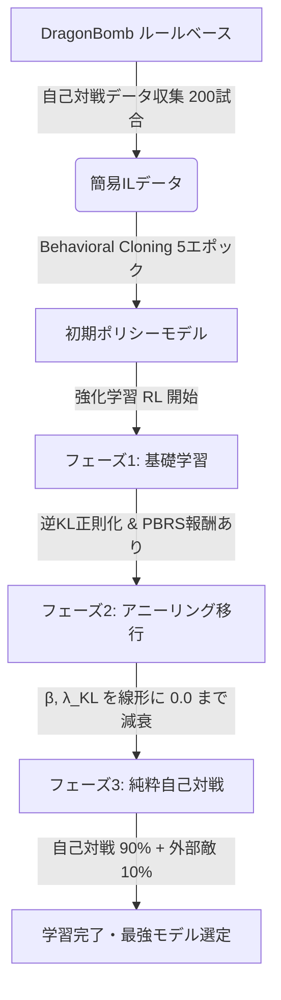

# ドラパルトボム RL エージェント 学習実行ガイド (rl_training_guide.md)

本ドキュメントは、ドラパルトex + カースドボム専用の強化学習（RL）エージェントの学習プロセス、リソース配置、実行手順、および学習目標について解説します。

---

## 1. 学習可能な環境の現状

現在、以下のモジュール群により**ローカル（GPU/CPU）およびGCP（GPU）環境で直接学習を回せる環境が完全に構築されています。**

* **[train_loop.py](file:///workspaces/pole/agents_draft/rl_drapa/train_loop.py)**: メイン学習実行スクリプト。
* **[training.py](file:///workspaces/pole/agents_draft/rl_drapa/training.py)**: PPOアップデート、逆KL正則化、および Behavioral Cloning 事前学習ステップを実装。
* **動作検証結果**: 簡易データ自己収集 → BC事前学習 → 逆KL正則化を適用した強化学習への移行まで、警告・エラーなしで正常に動作することを確認済みです。

---

## 2. 学習戦略：3段階のカリキュラム学習とアニーリング

直接強化学習をゼロから始めると、「自爆時のサイド献上ペナルティ」を恐れるあまり「ヨノワールを出さない・自爆しない」という局所的な回避行動にスタックするリスクが極めて高いです。
本環境では、これを回避するために **「計画B-2（ルールベースからの事前学習 ＋ 逆KL正則化アニーリング）」** を採用しています。

### 学習の全体フロー


### 各フェーズの詳細と移行条件

| フェーズ | 主要ターゲット（対戦相手ウェイト） | 移行・終了条件 | 補助パラメータの挙動 |
| :--- | :--- | :--- | :--- |
| **事前学習** | なし (ルールベースのデータを使用) | 200ゲームデータ収集 / 5エポック学習完了後、自動でRLへ移行 | 事前学習後のウェイトを `il_model.pt` として固定保存 |
| **フェーズ1** | StarEx (70%), IonoBellibolt (20%), Random (10%) | `episode >= 100,000`<br>または `episode >= 20,000` かつ **ミラー除く加重勝率 > 35%** | $\beta = 0.05$ (PBRS)<br>$\lambda_{\text{KL}} = 0.01$ (逆KL) |
| **フェーズ2** | StarEx (40%), Mirror (30%), Iono (20%), Random (10%) | `episode >= 300,000`<br>または `episode >= 100,000` かつ **ミラー含む加重勝率 > 55%** | $\beta$: $0.05 \to 0.0$ に線形減衰<br>$\lambda_{\text{KL}}$: $0.01 \to 0.0$ に線形減衰 |
| **フェーズ3** | 自己対戦 (90%), StarEx (5%), Mirror (5%) | 目標性能（勝率）に達するまで無制限 | $\beta = 0.0$ (補助報酬なし)<br>$\lambda_{\text{KL}} = 0.0$ (正則化なし) |

---

## 3. 各環境での学習量の目安とスループット

### 3.1 ローカルGPU (RTX 5060 Ti) での学習
ローカル環境では、マシンの過熱を防ぎつつ、基本的な動作チェックや中規模学習（1万ゲーム規模）を行うのに適しています。

* **予測スループット**: 約 **0.5 〜 0.7 games/sec** (NN推論込み)
  * ※ C++シミュレータ自体がシングルスレッド設計であるため、CPUボトルネックが発生します。
* **学習時間とエピソード数目安**:
  * **1,000 ゲーム (動作/学習チェック)**: 約 **25 〜 30 分**
  * **10,000 ゲーム (中規模学習・基礎習得)**: 約 **4 〜 5.5 時間**
  * **100,000 ゲーム (本格学習の初期段階)**: 約 **40 〜 55 時間** (数日間の連続稼働が必要)

### 3.2 GCP (L4 GPU + c2-standard-32) での学習
仕様書が想定する本番の学習環境です。32 vCPUを活用し、複数プロセスによる並列ロールアウト（32プロセス並列以上）を走らせることで、スループットを最大化させます。

* **予測スループット**: 約 **3.0 〜 5.0 games/sec** (並列スレッド効率化時)
* **学習時間とエピソード数目安**:
  * **10,000 ゲーム (基礎習得)**: 約 **30 〜 60 分**
  * **100,000 ゲーム (フェーズ2完了目安)**: 約 **5 〜 8 時間**
  * **300,000 ゲーム (フルカリキュラム完了)**: 約 **16 〜 24 時間** (約1日で完了)
* **コスト見積もり (クレジット消費)**:
  * システム全体の時間単価は約 **¥400 〜 430/h**。
  * 300,000ゲームの学習1回（約24時間）あたり、約 **¥10,000** のクレジットを消費します。
  * 無料クレジット予算 (¥159,885) 内で、およそ **10 〜 15 回** のフルパラメータサーチ・再学習実験の実行が可能です。

---

## 4. 学習実行・管理手順

### 4.1 コマンド実行例

#### A. ローカルで 10,000 ゲーム学習を走らせる場合 (推奨)
ルールベースからの事前学習（BC）を自動実行し、その重みをベースに強化学習を開始します。
```bash
python train_loop.py --num-games 10000 --device cuda
```

#### B. 事前学習をスキップして強化学習から開始する場合
既に事前学習モデル（`checkpoints/il_model.pt`）が存在するか、事前学習なしで直接学習させたい場合に指定します。
```bash
python train_loop.py --num-games 10000 --device cuda --skip-pretrain
```

#### C. GCP 等で保存先やチェックポイント間隔を調整する場合
```bash
python train_loop.py --num-games 300000 --device cuda \
    --checkpoint-dir /mnt/ssd/checkpoints \
    --checkpoint-interval 1000 \
    --update-every 10
```

#### D. 切断された学習を最新のチェックポイントから再開する場合
`--auto-resume` を指定すると、`checkpoint-dir` から自動で最新のチェックポイント (`latest.pt` または最も新しい番号) を検出し、学習状況（エピソード数、最高勝率、オプティマイザ状態）をすべて引き継いで再開します。
```bash
python train_loop.py --num-games 10000 --device cuda --auto-resume
```

---

## 5. メトリクスの監視とモデル選定

### 5.1 ログの監視
学習の進行状況は、`checkpoints/logs/` (デフォルト) に出力される以下の CSV ログで監視できます。
- **episodes.csv**: 各エピソードの勝敗 (`won`)、獲得報酬 (`total_reward`)、対戦相手 (`opponent`)、フェーズ (`phase`)。
- **updates.csv**: PPO更新ごとの `policy_loss` (方策損失)、`value_loss` (価値損失)、`entropy` (多様性)、`kl_div` (逆KL正則化度)。
  - `kl_div` がフェーズ2の進行に伴って徐々に減衰し、0 に近づいていくことを確認してください。

### 5.2 モデルの選定
- **最高勝率モデル (`checkpoints/best_model.pt`)**: 移動平均勝率（窓幅50）が過去最高を更新した瞬間に自動保存されます。最終的なエージェントには、基本的にこのモデルを使用します。
- 提出用には、学習後に生成される `agents_draft/rl_drapa/model.pt` (もしくは `best_model.pt` の `model_state_dict` を抽出して `model.pt` に保存したもの) を同梱してパッケージングします。
